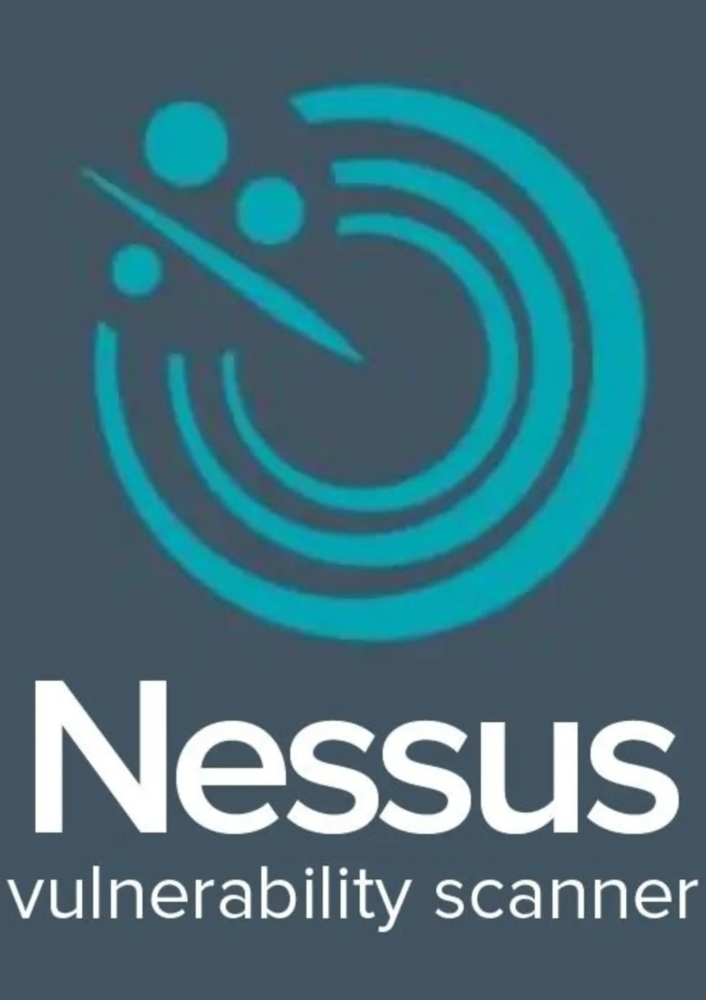
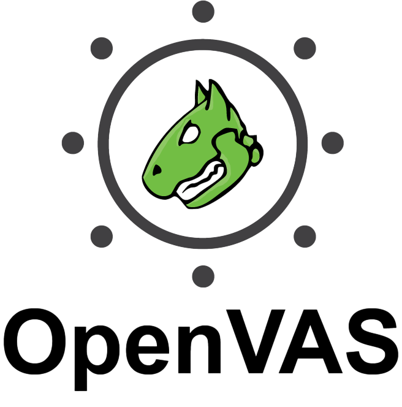

## Hey 👋, I'm Taukir Rahman!

### 👋 About Me  

I am a cybersecurity enthusiast passionate about SIEM solutions 🔎, with a main focus on **Wazuh integrations**. I also have experience in penetration testing 🕵️, Linux server administration 🐧, web servers (Nginx 🌐), and mail servers (Postfix 📧). I enjoy experimenting with open-source technologies 🔐, automating tasks ⚡, and continuously learning new ways to strengthen security systems.

### 🤝 Connect with me

<!-- GIF -->

### 🔨 Languages and Tools:

  <!-- Wazuh -->
  

  <!-- Nginx -->
  

  <!-- Postfix -->
  

  <!-- Nessus -->
  

  <!-- OpenVAS -->
  

  <!-- Acunetix -->
  

  <!-- Burp Suite -->
  

  <!-- Git -->
  

  <!-- Linux -->
  

  <!-- Bash -->
  

  <!-- Windows PowerShell -->
  

  <!-- Python -->
  

  <!-- HTML -->
  

  <!-- CSS -->
  

  <!-- MySQL -->
  

 

  
### 🧐 More About Me:

- 🔭 &nbsp; I’m currently working on **Wazuh Implementation for a complete SIEM solution**
- 🌱 &nbsp; I’m currently learning Windows Powershell Core   
- 👨🏻‍💻 &nbsp; Most of my projects are available on [Github](https://github.com/Taukir1515)
- 💬 &nbsp; Ask me about anything tech related, I will be happy to help
- 📫 &nbsp; Feel free to ping me on [LinkedIn](https://linkedin.com/in/taukirrahman)
- 📝 &nbsp; Check out my [resume]()
- 🎬 &nbsp; I am just a fan of Marvel Movies

 

### 📊 Github Stats
<a href='https://github.com/rahul-jha98/github-stats-transparent'>
  
<a>
  

    
  

</a>

